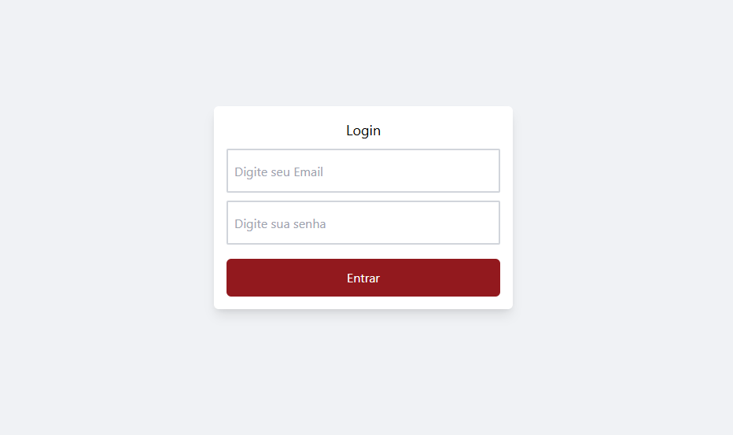
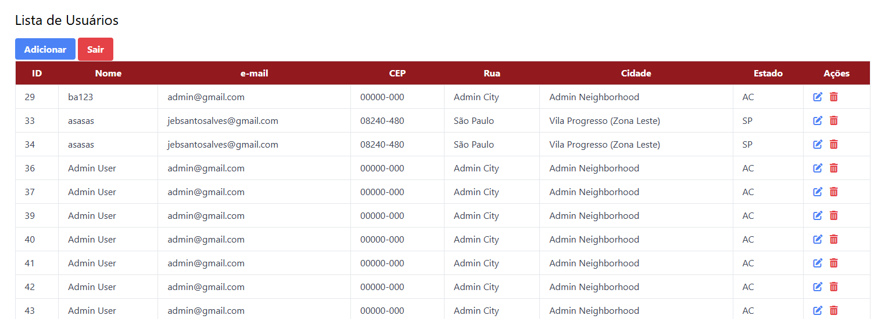
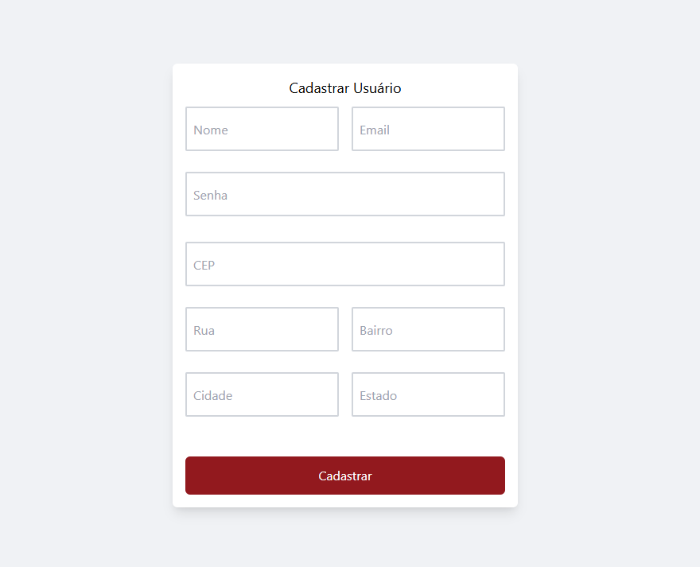

# Projeto Frontend - Cadastro de Pessoas com ViaCEP e Autenticação JWT

Este é o frontend do mini projeto de cadastro de pessoas, com integração à API do ViaCEP e autenticação JWT.





## Funcionalidades

- Tela de Login para usuários.
- Cadastro de pessoa com nome, idade, sexo e endereço.
- Busca automática do endereço pelo CEP utilizando a API do ViaCEP.
- Armazenamento do token JWT no `localStorage` ou `sessionStorage` para autenticação.
- Deslogar automaticamente caso o token expire ou seja invalidado.

## Tecnologias Utilizadas

- **HTML5**, **CSS3** e **JavaScript** para o desenvolvimento da interface.
- **Axios** para requisições HTTP.
- **Tawilnd** (opcional) para estilização.
- Armazenamento de tokens JWT no `localStorage` ou `sessionStorage`.

## Requisitos

- Navegador web moderno.
- Backend funcional para realizar autenticação e operações de CRUD.

## Como Executar o Projeto

1. Clone este repositório:
   ```bash
   git clone https://github.com/JoaoEnrique/crud-node-express.git
2. Gere o token JWT:
   ```bash
   node src/generate-token.js
3. Configure o Backend e a chave gerada:
   ```bash
    PORT=8080
    TOKEN_SECRET=your-token
    API_URL=http://localhost:5000 # Gere com node src/generate-token.js